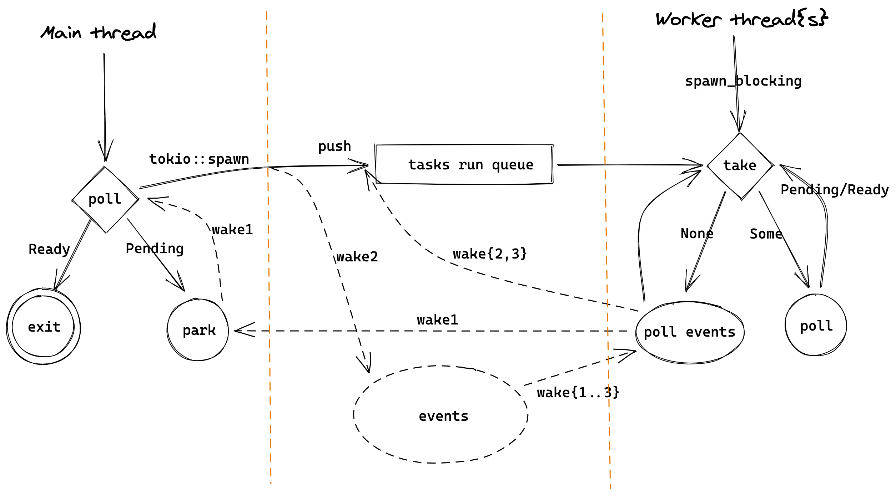

# Tokio 概览

## 初识 Tokio

Tokio 是一个 Rust 异步运行时库，底层基于 epoll/kqueue 这样的跨平台多路复用 IO 和 event loop，目前正在支持 io_uring。它的 scheduler 和 Erlang 或 Go 实现的 N:M threads 类似，线程会执行 Task，可以充分利用多核。Task 是 Rust 基于 Future 抽象出的一种绿色线程，是 future 执行单位，因为不需要预先分配多余的栈内存，可以创建大量 task，很适合做 IO 密集型应用。

虽然如 #0 所说，Rust 本身不提供异步运行时，但因为 Rust 强大的 macro，我们可以非常方便地使用如 Tokio 这类第三方的 runtime。

```rust
#[tokio::main]
async fn main() -> Result<(), Box<dyn Error>> {
    let listener = TcpListener::bind("127.0.0.1:8080").await?;  // listen

    loop {
        let (mut socket, _) = listener.accept().await?; // async wait for incoming tcp socket

        tokio::spawn(async move {                       // create async task and let Tokio process it
            let mut buf = vec![0; 1024];

            loop {                                      // read and write data back until EOF
                let n = socket.read(&mut buf).await?;   // async wait for incoming data

                if n == 0 { return; }

                socket.write_all(&buf[0..n]).await?;    // async wait socket is ready to write and write data
            }
        });
    }
}
```

如上边这段代码，在 Tokio 中可以很容易地写一个常见的 TCP server，主线程 listen 端口，并在循环中接受连接，每一个连接的处理都在一个 future 中完成，当等待 IO 时，这个 future 会让出 CPU 给其他 future，于是我们就有了一个高性能、高并发的 TCP server。后边代码解析会以这段代码为示例。

## 架构概览

这里的 "magic" 就在 `#[tokio::main]` 这个宏，它会把代码预处理成这样：

```rust
fn main() {
    tokio::runtime::Builder::new_multi_thread().enable_all()
        .build().unwrap()
        .block_on(async {
            // async main
        })
}
```

程序启动时，在 `build` 中会初始化各种需要的数据、IO 资源，以及启动 worker 线程，然后在主线程中运行 `async` 代码 block，也就是我们自己写的那个 `async main`。


[https://excalidraw.com/#json=5702836293730304,C8QpKXhqtfruHNN-J_ljcA](https://excalidraw.com/#json=5702836293730304,C8QpKXhqtfruHNN-J_ljcA)

上图大致描绘了以 echo 这个 example 为例的一个 Tokio runtime 的大致架构，对于理解 Tokio 很有帮助，之后的讲解也会多次再提及。

worker 线程一般数量和核数相同，会执行 `tokio::spawn` 提交的 future，当没有可执行的 task 时，会通过 epoll/kqueue 来 poll events，这部分工作由 reactor 负责。当被 events 唤醒后，会继续尝试执行 tasks，并这样循环下去。

runtime 在主线程 `block_on` 中会 poll 我们的 main 函数 future，执行到 `listener.accept().await?` 会返回 `Pending`，于是主线程会被挂起（park），在这里是等待信号量并休眠。

（wake1）当收到 TCP 连接时，worker thread 会在 `poll events` 中拿到 events，并发送信号量给主线程。主线程会从 `park` 中被唤醒，然后继续执行 `tokio::spawn`。worker 线程会继续循环，在这里就是 poll events。

（wake2）主线程在 `tokio::spawn` 中会先把 TCP 连接的 future 放到 run queue 中，然后唤醒 worker thread，再回到等待 TCP accept 中。worker 线程收到 events 后会从 run queue 中取出 task 并执行，也就是 `let mut buf = vec![0; 1024];` 开始的那段代码。

当 worker 线程执行 `socket.read(&mut buf).await?` 时，因为还数据还没有准备好，不能 read，会返回 `Pending`，再执行其他 tasks 或者等到 IO events。

（wake3）当 OS 收到 TCP 数据时，worker 线程会收到 events，并把之前未执行完的 future 放到 run queue 中，然后从 run queue 中取出并执行，这里会调用 syscall `read` 读取收到的数据，然后把数据写回 client。随后如果客户端关闭了连接，这个 task 就执行结束，worker 线程就会执行其他 task 或者等待 events。

这里有两个值得注意的地方。第一， `tasks run queue` 是有多个的，包括每个 worker 自己的 queue 和 global queue，worker 会优先从自己 queue 中取 task，在 [Task run queue] 中会单独讲。另一个地方是，多个 worker 线程会并发地执行 tasks，但只有一个 worker 线程会作为 reactor 来 poll events，新的 events 可能是由 reactor 自己，也可能是由其他 worker 线程来执行对应的 future。

## 代码目录和结构

从 `Cargo.toml` 可以看出 tokio 是一个包含了多个子 package 的 workspace，主要包括 `tokio`, `tokio-macros`, `tokio-stream`, `tokio-util` 和测试、examples 等其他代码。`tokio-stream` 是 [Stream](https://docs.rs/futures-core/0.3.14/futures_core/stream/trait.Stream.html) 的实现，`tokio-util` 是给 tokio 的使用者用的，我们先暂时不管，所以主要的代码在其他两个子 package，我们看下它们的代码量：

```rust
-------------------------------------------------------------------------------
Language                     files          blank        comment           code
-------------------------------------------------------------------------------
# tokio/src
Rust                           256           6332          23616          26233

# tokio-macros/src
Rust                             3             50            266            410
```

代码主要集中在 `tokio` 中，另外还有差不多数量的 comment，可见文档和注释写的非常多。一共有2万多行代码，不过也包含了不少测试代码，还有部分代码是用来实现一些标准库对应的异步版本，所以实际上我们一开始需要关注的代码没有那么多。

另外，还有一些主要的依赖：

- [bytes](https://github.com/tokio-rs/bytes): 处理 bytes 的工具
- [mio](https://github.com/tokio-rs/mio): 封装了跨平台的 IO 操作，比如 epoll, kqueue 等
- [parking_lot](https://github.com/Amanieu/parking_lot): 实现了很多同步原语，如锁、信号量

我们看一下 tokio 的子模块：

```rust
.
# core
├── lib.rs        // library file
├── blocking.rs   // 提供 blocking 操作的封装
├── coop.rs       // 帮助实现更好的协同式调度
├── future        // future 操作的一些封装
├── park          // 类似于 std::thread::park，但更加通用
├── runtime       // Tokio runtime 的核心，包括 event loop，任务管理、调度，线程池等等
├── sync          // 让不同 task 用来进行同步的工具，如 channel 和 Mutex
├── task          // 上文介绍的 task

# async std in Tokio
├── io            // IO 操作的封装，相当于异步的 std::io，也是构建 net、fs 等子模块的基础
├── net           // TCP/UDP/Unix 的封装，类似于 std::net
├── fs            // 异步的 std::fs
├── process       // 异步进程管理，比如可以异步地运行一个子进程，类似于 std::process
├── signal        // 异步的信号处理，如 ctrl-c
├── time          // 时间相关的模块，如 Sleep

# utils
├── loom          // 统一了 std 和 loom(github.com/tokio-rs/loom) 的接口来方便测试
├── macros        // 一些公用的 macro，主要是声明宏。而 tokio-macro 主要是过程宏
└── util          // tokio 内部代码通用的工具模块
```

一开始我们主要关注 core 部分的模块、echo example 涉及的 io 和 net 模块，以及代码涉及到的 macros 和 util 模块。

另外，Tokio 里用到一些 [feature flag](https://docs.rs/tokio/1.5.0/tokio/index.html#feature-flags) 来允许定制化一些功能，如 `rt-multi-thread` 会开启多线程调度器， `full` 会开启几乎所有 feature，实际当中也可以根据需要关闭一些。
