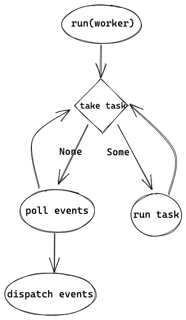

# worker 线程 - event loop

worker 线程的代码入口就是我们在 #2 提到过，现在再看一下：

```rust
// let mut builder = thread::Builder::new();
// builder.spawn(move || {
    rt.blocking_spawner.inner.run(id);
// })
```

这里先把 `rt`(`runtime::Handle`）的 clone 放到 thread local 中，然后开始执行主要逻辑 `rt.blocking_spawner.inner.run`。

## worker 线程执行

以下是 `run` 的代码：

```rust
'main: loop {
		// BUSY
	  while let Some(task) = shared.queue.pop_front() {
		    task.run();
	  }
		while !shared.shutdown {
				let lock_result = self.condvar.wait_timeout(shared, self.keep_alive);

				if shared.num_notify != 0 {
						break;
				}
		}
		if shared.shutdown {
				// ...
				break;
		}
}
```

逻辑还算比较简单，会不断从 blocking run queue 中取 task 来运行，没有 task 可以执行的话，就等待信号量或者超时退出。需要注意的是，这里是 blocking 线程池的通用逻辑，`task` 并不是 tokio::spawn 创建的轻量级线程，而是 worker 线程的特定逻辑，worker 线程会一直执行这个 `task.run()`，也就是之前提过的 `launch` ([https://github.com/tokio-rs/tokio/blob/a5ee2f0d3d78daa01e2c6c12d22b82474dc5c32a/tokio/src/runtime/thread_pool/worker.rs#L279](https://github.com/tokio-rs/tokio/blob/a5ee2f0d3d78daa01e2c6c12d22b82474dc5c32a/tokio/src/runtime/thread_pool/worker.rs#L279)) 中的 `run(worker)`。以下是 `run(worker)` 的代码：

```rust
let core = match worker.core.take()

let cx = Context {
    worker,
    core: RefCell::new(None),
};

while !core.is_shutdown {
    // Increment the tick
    core.tick();

		core = self.maintenance(core);

    // First, check work available to the current worker.
    if let Some(task) = core.next_task(&self.worker) {
        core = self.run_task(task, core)?;
        continue;
    }

    // There is no more **local** work to process, try to steal work
    // from other workers.
    if let Some(task) = core.steal_work(&self.worker) {
        core = self.run_task(task, core)?;
    } else {
        // Wait for work
        core = self.park(core);
    }
}
```

worker 线程的整体逻辑是在循环中，先尝试运行 task `self.run_task(task, core)?`，如果没有 task 可运行就会 `park`。worker 会从多个地方获取要执行的 task，包括 global queue、local queue，甚至还会从其他线程 "steal" 任务，我们在最后的 #8 中更详细地讲解。先假设此时是主线程 accept 的时候，还没有请求要处理，于是会调用 `park`。

## 等待 events

```rust
while !core.is_shutdown {
    core = self.park_timeout(core, None);
}
```

上边是 `park(core)` 的整体逻辑，虽然有个循环，但主要还是 `park_timeout`，加上循环只是为了判断从 park_timeout 中返回后，是不是真的被唤醒有任务可以执行，否则还会继续 park_timeout:

```rust
// self.park_timeout(core, None):
let mut park = core.park.take().expect("park missing");

// https://github.com/tokio-rs/tokio/blob/a5ee2f0d3d78daa01e2c6c12d22b82474dc5c32a/tokio/src/runtime/park.rs#L92
if let Some(mut driver) = park.shared.driver.try_lock() {
    self.park_driver(&mut driver);
} else {
    self.park_condvar();
}
```

当我们有多个 worker threads 时，只有一个 worker 会抢到 `runtime::driver::Driver` 而执行 `park_driver`，其他 worker 会 `park_condvar`，后边会看到 `park_driver` 其实就是 poll events，因此只有一个 worker 线程会成为 reactor。以下是 `park_driver` 的入口：

```rust
match self
      .state
      .compare_exchange(EMPTY, PARKED_DRIVER, SeqCst, SeqCst)
{
  // ...
}

driver.park().unwrap();

self.state.swap(EMPTY, SeqCst)
```

在调用实际的 `park` 之前会设置状态为对应的 `state`（`PARKED_DRIVER` 或 `PARKED_CONDVAR`），所以 #4 中当主线程要唤醒 worker 线程时，`unpark` 才知道如何用正确的方法。

来看 `driver.park()`:

```rust
const COMPACT_INTERVAL: u8 = 255;

self.tick = self.tick.wrapping_add(1);
if self.tick == COMPACT_INTERVAL {
    self.resources.as_mut().unwrap().compact()
}

match self.poll.poll(&mut events, max_wait) {
}

// dispatch events and more
```

我们看到了 #7 中的 driver tick，每次 poll 时就会加 1，当 tick 到 255 时会执行 compact。

## Event dispatch

来单独看一下 poll 和之后的代码：

```rust
match self.poll.poll(&mut events, max_wait)

for event in events.iter() {
    let token = event.token();

    if token != TOKEN_WAKEUP {
        self.dispatch(token, Ready::from_mio(event));
    }
}
```

`self.poll.poll` 就是通过 mio 来 poll 事件，当没有事件时就会阻塞，当收到事件时，就会返回，并设置好 events。每个 event 会带着 token，就是 #3 中讲过的注册事件时会生产的 token，#7 中也有单独讲。如果 token 是之前讲过的 `TOKEN_WAKEUP`，则只是用来唤醒 worker 线程用的，比如 `tokio::spawn` 被调用时，就可以执行 tasks。其他 token 则会被 `dispatch` 用来分发事件：

```rust
let addr = slab::Address::from_usize(ADDRESS.unpack(token.0));

let resources = self.resources.as_mut().unwrap();

let io = match resources.get(addr) {
    Some(io) => io,
    None => return,
};

let res = io.set_readiness(Some(token.0), Tick::Set(self.tick),
		|curr| curr | ready);

io.wake(ready);
```

token 中包含 Slab slot 的地址，因此先从 token 中获取 address，然后获取对应地址的 `ScheduledIO`。`ScheduledIO` 主要包含 IO ready 的状态和 waker，这里会调用它的 `set_readiness` 来设置 ready 的状态：

```rust
let mut current = self.readiness.load(Acquire);

loop {
    let current_generation = GENERATION.unpack(current);

		// 1.
    if let Some(token) = token {
        if GENERATION.unpack(token) != current_generation {
            return Err(());
        }
    }

		// 2.
    let current_readiness = Ready::from_usize(current);
    let new = f(current_readiness);

		// 3.
    let packed = match tick {
        Tick::Set(t) => TICK.pack(t as usize, new.as_usize()),
        Tick::Clear(t) => {
            if TICK.unpack(current) as u8 != t {
                // Trying to clear readiness with an old event!
                return Err(());
            }

            TICK.pack(t as usize, new.as_usize())
        }
    };

		// 4.
    let next = GENERATION.pack(current_generation, packed);

    match self
        .readiness
        .compare_exchange(current, next, AcqRel, Acquire)
    {
				Ok(_) => return Ok(()),
        // we lost the race, retry!
        Err(actual) => current = actual,
    }
}
```

这段代码稍微有点长，可以简单分为 4 部分来看：

1. 检查 event 中的 generation 和 Slab ScheduledIO 中的是不是相同，来避免一些 race condition。在 #7 中会具体讲解
2. 通过调用匿名函数 `f` 来计算新的 readiness，在 `dispatch` 中就是 `curr | ready`，相当于把某些 bit 设为 1，比如可读就是最右的一位。
3. 当 `clear_readiness` （也是调用 `set_readines` ) 的时候，会检查 tick 是否相同，只有当相同时才会清除，防止老的 event 清除了新的状态。也会在 #7 中详解。
4. 把 `readiness` 状态更新为新的，如果由于竞争更新失败，就在 loop 中重试。

`readiness` 被更新之后，当下次 poll 时，就会拿到新的状态，就像之前讲过的 `async_io` 中， Readiness 的 poll 会读 `readiness`。

dispatch 的最后，会唤醒响应的线程：

```rust
// io.wake(ready):
for waiter in self.waiters.iter_mut().take(curr) {
    waiter.waker.take().unwrap().wake();
}
```

ScheduledIO 会遍历 waiters，拿到其中的 waker 并唤醒对应的线程。之前在 #3 中提到过 waiters 的设置，我们再来看一下：

```rust
// Readiness poll:
(*waiter.get()).waker = Some(cx.waker().clone());
waiters.list.push_front(unsafe { NonNull::new_unchecked(waiter.get()) });

// block_on:
let waker = self.get_unpark()?.into_waker();
let mut cx = Context::from_waker(&waker);
```

在 Readiness 的 `poll` 方法中，waiters 会把 context 中的 waker 加进去，而 context 就是 root future 被调用时创建的，根据实际调用而有所不同。比如，对于主线程，就是在入口函数 `block_on` 中，unpark 就是 `self.condvar.notify_one()`，因此当主线程中 `accept` 收到请求时，reactor 就会通过 condvar 唤醒主线程来继续执行，也就是 #1 中图里的 "wake1"。而对于 worker 线程，又有不同，我们之后会看到。

当 events 处理完了之后，worker 会从 `park` 中返回，回到一开始 `run(worker)` 的地方，并继续重复逻辑——先取 task 执行，没有可以执行的 task 就 poll events。

## 总结

worker 线程的整体逻辑就如 #1 图中的最右部分一样，在 blocking 线程中创建出来后，就一直执行 `run(worker)` ，在 `run(worker)` 中的 loop 里执行 task 或者作为 reactor poll events。


[https://excalidraw.com/#json=6084072971436032,c9KMKOoNhmOXqzSYoZEyUQ](https://excalidraw.com/#json=6084072971436032,c9KMKOoNhmOXqzSYoZEyUQ)
